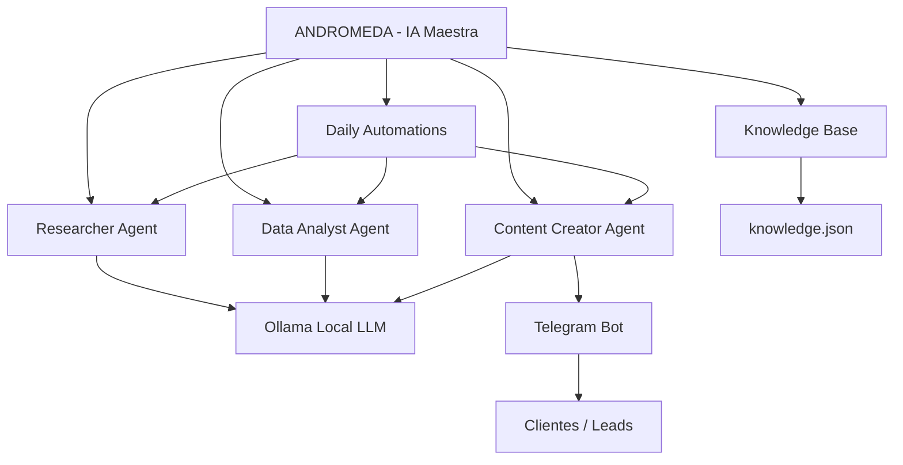
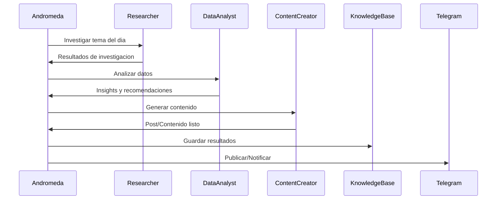
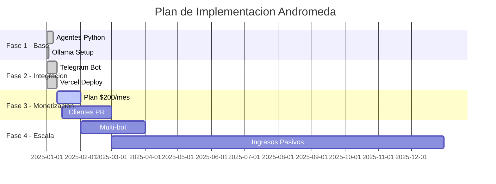

# ANDROMEDA MASTER PLAN - QUINTA AVENIDA PRO
## Genesis MetaWorks | Puerto Rico | 2025

---

## VISION GENERAL

Sistema de IA multi-agente totalmente automatizado que opera desde Ollama local,
generando ingresos pasivos para Genesis MetaWorks usando LLMs locales.

---

## ARQUITECTURA DEL SISTEMA



---

## FLUJO DE TRABAJO DIARIO



---

## FASES DE IMPLEMENTACION



---

## REPOSITORIOS ACTIVOS

| Bot | Repositorio | Estado |
|-----|-------------|--------|
| Quinta Avenida Pro | quinta-avenida-pro-bot | ACTIVO |
| Kemical Extreme | kemical-extreme-bot | ACTIVO |
| Barbosa Agency | barbosa-agency-pro-bot | ACTIVO |

---

## PARA EJECUTAR LOCALMENTE CON OLLAMA

```powershell
# 1. Asegurate de tener Ollama corriendo
ollama serve

# 2. Pull el modelo si no lo tienes
ollama pull llama3

# 3. Clonar el repo
git clone https://github.com/GENEZUX/quinta-avenida-pro-bot.git
cd quinta-avenida-pro-bot

# 4. Instalar dependencias
pip install requests flask python-telegram-bot

# 5. Ejecutar automatizaciones diarias
$env:OLLAMA_HOST="http://localhost:11434"
python -m bot.daily_automations
```

---

## INGRESOS PROYECTADOS

| Servicio | Precio/mes | Clientes meta |
|---------|-----------|---------------|
| Bot Telegram Pro | $200 | 10 |
| Automatizacion IA | $500 | 5 |
| Consultoria | $1000 | 3 |
| **TOTAL** | **$7500** | **18** |

---

*Generado por Andromeda | Genesis MetaWorks | Puerto Rico 2025*
